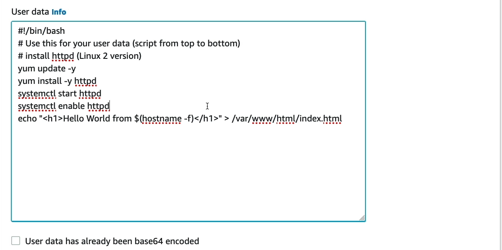

# EC2 Simplified Version

## Defination

Amazon EC2 (Elastic Compute Cloud) is like renting a computer that you can use through the internet. Instead of buying a physical computer, you can use EC2 to run applications, store data, and handle tasks on Amazon's powerful servers. This way, you only pay for the time you use it, and you can choose how powerful you want it to be, just like choosing different types of computers depending on what you need them for.

- It's Fully Managed Container Orchestration Service that helps you to more easily deploy Scale and then in containers 

**Key Features**

      - The following are the key features
            - SLA Commitment of 99.99% Availability 
            - AWS Nitro System is Build in for the Security 
            - We have Savings Plan which optimize the Performance to save cost 
            - It Has Migration tools which makes it easy to Switch between the Clouds with Amazon Lightsail or AWS Managed Services 
            - 

<h5 align="center" > 
     
    This is the Image of EC2 Logo
</h5>

## Instance Types 
- **General Purpose**: Think of these like your standard family car – versatile and cost-effective. Good for web servers or development environments. Example: `t2.micro`.
- **Compute Optimized**: These are like sports cars – built for speed! Best for applications that need a lot of processing power, like batch processing. Example: `c5.large`.
- **Memory Optimized**: Consider these as cargo trucks – they can carry a lot of memory load. Ideal for large databases or real-time big data processing. Example: `r5.large`.
- **Storage Optimized**: These are like warehouses on wheels – great for jobs that need quick access to large amounts of data, like data warehousing. Example: `d2.xlarge`.
- **Accelerated Computing**: Think of these as rocket ships – they use special boosters (hardware accelerators) to perform complex calculations quickly. Suitable for graphics processing or data pattern matching. Example: `p3.2xlarge`.
- **Bare Metal**: Like owning the building itself – you control everything from the ground up. Provides direct access to hardware for applications that need to avoid virtualization. Example: `i3.metal`.
- **Micro Instances**: These are like scooters – small, economical, and perfect for low traffic sites or personal projects. Example: `t1.micro`.

### EC2 Configuration Options

Amazon EC2 provides several configuration options that allow you to tailor your virtual machine to your specific needs. Here are some of the key configuration options:

1. **Instance Types**: Choose from a variety of instance types based on the CPU, memory, and storage that best fit your application. For example, a `t2.micro` instance is great for low-traffic websites, while a `c5.9xlarge` is better suited for compute-intensive applications.

2. **Storage Options**: EC2 offers different types of storage including:

   - **EBS (Elastic Block Store)**: Persistent storage volumes for your data, which can be attached to any EC2 instance. For example, use an `EBS General Purpose SSD (gp2)` for a balance of price and performance.
   - **Instance Store**: Temporary storage that is physically attached to the host computer. Instance store is ideal for temporary data that changes frequently, like buffer, cache, or scratch data.

3. **Network Settings**: Configure the VPC (Virtual Private Cloud) and security groups to control inbound and outbound traffic to your instances. For example, you might allow only HTTP and SSH traffic to reach your web server.

4. **AMI (Amazon Machine Image)**: Select from pre-configured AMIs or create your own with the operating system and software stack required for your application.

5. **Key Pairs**: Use key pairs for secure SSH access to your instances. Generate a key pair in the EC2 console, and use the private key to log in securely.

### Simple Example

Think of Amazon EC2 like a hotel for computers. When you travel, instead of buying a house, you rent a hotel room with features you need: maybe just a bed and bathroom, or perhaps a suite with multiple rooms and luxury amenities. Similarly, with EC2, you rent computing power with the specific features you need for as long as you need it. You can choose the size of the "room" (instance type), the type of "bed" (storage), and even the "view" (network settings) to ensure your stay (computing task) is exactly as you want it.

#### BootStrap Scripts

- Bootstrap scripts in EC2, also known as user data, are used to automatically configure an instance upon startup. You can use these scripts to install software, update settings, or run administrative tasks. This feature is particularly useful for automating the setup process of instances, ensuring that they are fully configured and ready to use as soon as they launch.

    <h5 align="center">
        
         
        EC2: 1 Please refer to this Image - [Bootstrap Script]
    </h5>

    ### Security Groups: The Gatekeepers

Imagine you live in a gated community where the security at the gate decides who can come in and who can go out based on a list of rules you've provided. In Amazon EC2, Security Groups serve a similar purpose. They act as virtual firewalls that control the traffic for one or more instances. When you launch an instance, you associate it with one or more security groups. You set rules that specify the allowed incoming and outgoing traffic.

For example, if you have a web server, you might allow all traffic on port 80 (HTTP) and 443 (HTTPS) from anywhere but restrict SSH access (port 22) to just your IP address. This setup ensures that your website is accessible to the world but keeps your administrative access private.

Security Groups are stateful, meaning if you send a request from your instance, the response traffic for that request is allowed to flow in regardless of inbound security group rules. Conversely, if an inbound rule allows traffic, the response is allowed to flow out, making the management of bidirectional traffic simple and secure.

#### Interesting Examples of Security Group Configurations:

1. **Blog Hosting**: For a personal blog, you might allow HTTP and HTTPS traffic to ensure visitors can access your site, while restricting all other ports to prevent unauthorized access to the underlying server.

2. **Gaming Server**: For a gaming server, specific ports need to be open for game traffic. You could set rules to allow traffic on the gaming port from anywhere, plus a management port open only to your network, ensuring both public access to the game and secure admin access.

3. **Database Server**: For a database, you might restrict all traffic except from specific EC2 instances that serve as application servers, thereby creating a private network for your sensitive data.

These examples show how Security Groups can be tailored to meet the specific needs of different applications, providing flexibility and enhancing security.

#### Classic Ports Table for Common Services

| Service         | Port Number | Protocol | Description                                  |
|-----------------|-------------|----------|----------------------------------------------|
| HTTP            | 80          | TCP      | Standard web traffic                         |
| HTTPS           | 443         | TCP      | Secure web traffic                           |
| FTP             | 21          | TCP      | File Transfer Protocol                       |
| SSH             | 22          | TCP      | Secure Shell for secure remote administration|
| SMTP            | 25          | TCP      | Simple Mail Transfer Protocol                |
| DNS             | 53          | TCP/UDP  | Domain Name System                           |
| DHCP            | 67, 68      | UDP      | Dynamic Host Configuration Protocol          |
| RDP             | 3389        | TCP      | Remote Desktop Protocol                      |
| MySQL           | 3306        | TCP      | MySQL Database Service                       |
| PostgreSQL      | 5432        | TCP      | PostgreSQL Database Service                  |

This table lists some of the classic ports used by common services, which are important to know when configuring security groups in EC2 for appropriate access control.

for More Info we can search articles in IP-Tables 

### EC2 Instances Purchasing Options  [ORS-DDS]

When deciding how to purchase EC2 instances, think of it like choosing a payment plan for a mobile phone. There are several options, each with its own benefits depending on your usage patterns and financial preferences.

#### 1. **On-Demand Instances**
   - **Like**: Pay-as-you-go mobile plans.
   - **Example**: Use On-Demand instances when you have short-term, irregular workloads that cannot be interrupted. Ideal for developing new applications or when you need the flexibility to turn off the service without financial penalty.

#### 2. **Reserved Instances**
   - **Like**: Yearly subscription with a significant discount.
   - **Example**: Best for applications with steady state usage where you can commit to using EC2 over a 1 or 3 year period. This option provides a discount of up to 75% compared to On-Demand pricing.

#### 3. **Spot Instances**
   - **Like**: Bidding in an auction for unused capacity.
   - **Example**: Suitable for flexible, fault-tolerant applications that can handle possible instance interruptions. Spot Instances offer the potential for significant savings (up to 90% off the On-Demand price) if your application can start and stop at times that align with spot capacity availability.

#### 4. **Dedicated Hosts**
   - **Like**: Renting an entire server building for exclusive use.
   - **Example**: Useful for regulatory requirements that may not support multi-tenant virtualization, or for licensing that doesn't support cloud-based deployment. Dedicated Hosts allow you to use your existing server-bound software licenses and control instance placement.

#### 5. **Dedicated Instances**
   - **Like**: Renting a private floor in a shared building.
   - **Example**: Similar to Dedicated Hosts but with instances running on physical servers that may be shared with other AWS accounts. This option is typically used for workloads that need to be isolated from other customers at the hardware level but do not require control over instance placement.

#### 6. **Savings Plans**
   - **Like**: Membership club savings.
   - **Example**: Offers significant savings over On-Demand pricing in exchange for a commitment to use a specific amount of compute power (measured in $/hour) for a 1 or 3 year period. Suitable for users who can commit to a consistent amount of usage and want the flexibility to change instance types across regions.

Each purchasing option has its own advantages and is suitable for different types of workloads and financial strategies. Choosing the right option can lead to cost savings and operational efficiencies.

| Purchasing Option  | Description                                   | Use Case Example                                  |
|--------------------|-----------------------------------------------|---------------------------------------------------|
| On-Demand          | Pay for what you use, no long-term commitment | Short-term, irregular workloads                   |
| Reserved           | Discounted rate for a fixed term commitment   | Applications with steady usage                    |
| Spot               | Bid for unused capacity at lower prices       | Flexible applications that can handle interruptions|
| Dedicated Hosts    | Physical server for your exclusive use        | Compliance or licensing needs                     |
| Dedicated Instances| Isolated hardware, shared physical server     | Workloads needing hardware isolation              |
| Savings Plans      | Discounted rates for consistent usage         | Long-term, predictable usage                       |

#### Private vs Public (IPv4)

[IPv4](./IPv4.md)

#### Placement Groups

Placement groups in AWS EC2 are akin to strategically arranging your office desks to optimize communication and performance among teams. They are used to control how instances are placed on the underlying hardware, which can significantly impact the performance of applications.

#### Types of Placement Groups

1. **Cluster Placement Groups**
   - **Like**: Like seating a project team close together in a single room to enhance collaboration and speed.
   - **Description**: All instances are grouped together in a low-latency network in a single Availability Zone. This is ideal for high-performance computing (HPC) applications that need high network throughput and low latency.

2. **Spread Placement Groups**
   - **Like**: Like assigning individual offices to key executives across different floors to reduce the risk of everyone being unavailable if one area is affected.
   - **Description**: Instances are placed on distinct underlying hardware to reduce the risk of simultaneous failures. Suitable for applications that need to be isolated from failure of a single hardware component.

3. **Partition Placement Groups**
   - **Like**: Like dividing a large office floor into sections for different departments, ensuring that each team has its own space but is still within the same building.
   - **Description**: Instances are grouped into different partitions (each partition has its own set of hardware) within an Availability Zone. This is useful for large distributed and replicated workloads, such as Hadoop, Cassandra, and Kafka.

Choosing the right type of placement group depends on the specific needs and requirements of your application, such as performance, fault tolerance, and latency.

#### Elastic Network Interface

An Elastic Network Interface (ENI) is essentially a virtual network card. It enables you to design a networking architecture within AWS that meets the requirements of your application. ENIs can be attached to EC2 instances and are used to enable network communication.

#### Features of Elastic Network Interfaces:
- **Multiple IPs**: You can assign one or more private IPv4 or IPv6 addresses to an ENI.
- **Elastic IP Attachments**: You can attach one or more Elastic IPs to an ENI.
- **Security Groups**: You can associate security groups with an ENI to control traffic at a granular level.
- **MAC Address**: Each ENI is assigned a static MAC address that persists across starts and stops.
- **Source/Destination Check**: By default, AWS performs source/destination checks. This can be disabled if the instance needs to route traffic.

#### Use Cases:
- **Failover**: Use ENIs for failover solutions by reattaching them to a standby instance in case the primary instance fails.
- **Multi-homed Instances**: Attach multiple ENIs to an instance to enable it to operate with multiple private IPs, potentially from different subnets.
- **Network and Security Appliances**: Ideal for use with network appliances such as firewalls or load balancers that require dedicated network interfaces.

Understanding and utilizing ENIs can significantly enhance the networking capabilities of your AWS resources, providing flexibility, security, and scalability.
